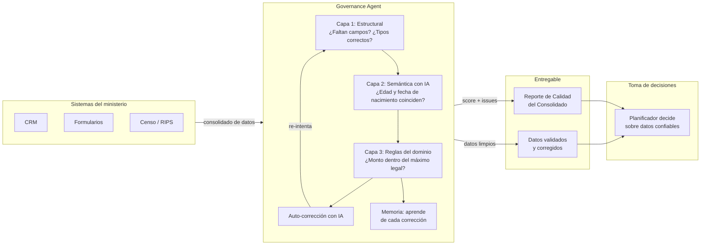

# Governance Agent

**Calidad de datos con IA para apoyar la gestión pública**

---

## Tabla de contenidos

- [Descripción](#descripción)
- [El problema](#el-problema)
- [Cómo funciona](#cómo-funciona)
- [Casos de uso](#casos-de-uso)
- [Diferenciación con herramientas existentes](#diferenciación-con-herramientas-existentes)
- [Nivel de esfuerzo de implementación](#nivel-de-esfuerzo-de-implementación)
- [Requisitos técnicos](#requisitos-técnicos)
- [Roadmap](#roadmap)
- [Contribuir](#contribuir)
- [Licencia](#licencia)
- [Contacto](#contacto)

---

## Descripción

Governance Agent es una herramienta de código abierto que asegura la calidad de los datos como insumo para la gestión pública. Cada ministerio o institución configura su nomenclador, reglas y validadores en un módulo intercambiable. Cuando la institución consolida datos de sus sistemas para planificar o evaluar, Governance Agent valida que sean estructuralmente correctos, semánticamente consistentes mediante IA, y coherentes con el clasificador de variables del dominio.

Si hay errores, el agente los corrige automáticamente. Si no puede, pregunta al planificador sin detener el proceso. Y aprende de cada corrección para no repetir errores.

Si la institución aún no cuenta con un clasificador de variables o nomenclador formal, Governance Agent puede apoyar su construcción: la herramienta es capaz de inferir automáticamente la estructura de los datos a partir de los modelos existentes en los sistemas transaccionales, y generar una configuración inicial que el equipo técnico puede luego refinar. Adicionalmente, el agente puede incorporar documentación normativa y técnica del dominio como respaldo para la validación semántica, sin requerir configuración manual compleja.

**¿Por qué?** Porque las decisiones de política pública —desde el diseño de un subsidio hasta el monitoreo de un programa— dependen de datos confiables. Si los datos tienen errores que nadie detectó, la decisión también estará equivocada.

**¿Para qué?** Entre otros usos: monitorear programas en ejecución, responder preguntas sobre los datos con confianza, detectar hallazgos que ningún sistema tradicional identifica, o gestionar de forma propositiva con datos integrados mediante el nomenclador.

**El resultado: gestión pública apoyada en datos confiables, sin importar la fuente.**

Para detalles de instalación, API, módulos y arquitectura, ver [docs/USO_TECNICO.md](docs/USO_TECNICO.md).

---

## El problema

Los gobiernos toman decisiones de política pública basadas en datos que provienen de múltiples sistemas transaccionales —registros administrativos, censos, formularios—. Estos datos tienen problemas de calidad que nadie detecta antes de usarlos para decidir:

- **Un mismo dato se llama distinto en cada sistema**: el Ministerio de Salud llama "cod_dx" al diagnóstico, el hospital lo llama "diagnostico", y el censo usa "CIE10". Nadie los reconcilia, y al consolidar los datos no se sabe que son la misma variable.

- **Datos que individualmente parecen correctos pero juntos son imposibles**: un registro dice "edad: 25" y "fecha de nacimiento: 2010". Cada campo por separado pasa la validación, pero juntos son contradictorios. Los sistemas tradicionales no detectan esto.

- **Datos fuera de rango o geográficamente inválidos**: un rendimiento de 50 toneladas por hectárea en papa cuando el rango normal es 15-25. Coordenadas que caen fuera del territorio de operación. Beneficiarios duplicados entre programas.

- **Errores de captura masivos**: en un consolidado típico, hasta el 30% de los registros pueden tener campos erróneos que pasan los controles básicos pero son lógicamente imposibles. Esas decisiones se toman con datos equivocados sin que nadie lo sepa.

---

## Cómo funciona

Governance Agent aplica tres capas de validación secuencial sobre el consolidado de datos:

**Capa 1 — Estructural**: Verifica tipos de datos, campos obligatorios, enumeraciones y rangos mínimo/máximo. Esta capa usa la configuración definida por el ministerio.

**Capa 2 — Reglas de dominio**: Ejecuta validadores específicos del dominio. Por ejemplo: verificar que el monto de un subsidio no exceda el máximo legal permitido, que los códigos existan en el nomenclador, o que un beneficiario no esté duplicado entre programas.

**Capa 3 — Semántica con IA**: Utiliza inteligencia artificial para razonar sobre los datos y detectar inconsistencias lógicas que las capas anteriores no pueden predecir. Por ejemplo: un registro con edad 25 y fecha de nacimiento 2010 es contradictorio, o un beneficiario con ingresos superiores al umbral del programa. El agente puede incorporar documentación normativa del dominio como respaldo para enriquecer el razonamiento semántico.

### Auto-corrección

Cuando se detectan errores críticos, el agente usa IA para corregir automáticamente los datos y re-intenta la validación. Si no puede corregir, bloquea y reporta.

### Human-in-the-loop

Los warnings (no críticos) se acumulan como preguntas en lote para el planificador. No detienen el proceso. El planificador responde al final, y el agente aprende de sus respuestas.

### Memoria acumulativa

Cada corrección aceptada o rechazada se almacena en la memoria del agente. Tras 5 aceptaciones de la misma corrección, se auto-promueve a regla automática. El agente aprende del dominio.

**El entregable**: un reporte de calidad del consolidado que muestra qué datos estaban mal, qué se corrigió automáticamente, y qué requiere revisión humana — antes de que el planificador use esos datos para tomar decisiones.

---

## Casos de uso

### Ministerio de Agricultura

Un ministerio de agricultura necesita apoyar una política de subsidios a pequeños productores. Consolida los datos anuales de su registro de productores. Governance Agent valida que todos los registros tengan los campos obligatorios, que los cultivos existan en el nomenclador, que las coordenadas estén en área agrícola, y que los rendimientos sean plausibles. Si un registro reporta 50 toneladas por hectárea en papa, el agente sugiere corregir a 18 (rango normal: 15-25).

### Ministerio de Salud

Un ministerio de salud consolida datos de RIPS, SISS y el censo para evaluar cobertura. Governance Agent valida que los códigos CIE-10 existan en el nomenclador, que los municipios sean válidos, y que no haya contradicciones lógicas entre campos como edad y fecha de nacimiento. Si encuentra "edad: 25" con "fecha de nacimiento: 2010", sugiere corregir la fecha a 1999.

### Programa de Beneficencia Social

Un programa de transferencias condicionadas necesita verificar la elegibilidad de beneficiarios antes de emitir pagos. Governance Agent valida que los ingresos declarados sean consistentes con la actividad económica registrada, que no haya beneficiarios duplicados entre programas, y que las composiciones familiares sean coherentes (ej: no registrar hijos mayores de edad como dependientes sin justificación). Si un beneficiario reporta ingresos superiores al umbral del programa, el agente marca el registro para revisión.

### Alcaldía Municipal

Una alcaldía consolida datos de catastro, registro civil y servicios públicos para planificar inversiones locales. Governance Agent valida que los predios existan en el catastro, que las direcciones correspondan al municipio, y que los datos sean coherentes. Si un predio de 5 m² está declarado como residencia familiar, el agente marca el registro como implausible para revisión.

### Consulta de viabilidad de política pública

Una vez que el nomenclador está construido, la institución puede consultar el grafo para responder preguntas de política pública antes de invertir en nuevos sistemas:

- **¿Podemos monitorear esta política?** — El gobierno consulta qué variables necesita el indicador, en qué sistemas están, y con qué calidad. Si la variable existe en dos sistemas pero con 60% de completitud, sabe que necesita mejorar la captura antes de usar el dato.
- **¿Podemos actualizar el indicador sin crear un sistema nuevo?** — El gobierno consulta los caminos de interoperabilidad entre sistemas. Si el censo y el hospital comparten la variable "sexo" con el mismo clasificador ISO 5218, puede cruzarlos sin construir un nuevo pipeline.
- **¿Podemos crear una política nueva con variables que ya existen?** — El gobierno descubre que tiene variables dispersas en tres ministerios que, combinadas, permiten diseñar un programa de transferencias condicionadas. El nomenclador identifica qué variables están disponibles, en qué fuentes, y qué calidad tienen — sin necesidad de nuevas encuestas.

### Gobernanza de variables y respaldo normativo

Cada variable del nomenclador tiene un **custodio institucional** (la persona o dirección responsable de mantenerla) y **respaldo normativo trazable** (la ley, resolución o norma que la respalda). Esto permite:

- **Saber quién responde por cada variable** — si el indicador de cobertura de vacunación tiene problemas, el nomenclador dice que el custodio es la Dirección de Inmunizaciones, no hay que adivinar.
- **Trazar el respaldo legal** — cada variable está vinculada al artículo específico de la norma que la respalda (ej: Art. 47 de la Ley General de Salud para vacunación obligatoria).
- **Auditar el cumplimiento normativo** — el gobierno puede listar qué variables tienen respaldo normativo y cuáles no, identificando brechas de gobernanza antes de que se conviertan en problemas legales.

### Construcción del nomenclador

¿Cómo se construye el nomenclador? Los ministerios tienen sus datos en sistemas distintos, con estructuras de datos que nadie ha revisado en años. Governance Agent lee esas estructuras tal como están, identifica qué variable corresponde a cada elemento, y arma el nomenclador automáticamente. El equipo del ministerio solo revisa y aprueba — no tiene que construirlo desde cero.

### Descubrimiento de oportunidades de política pública

A partir de las variables disponibles en el nomenclador, el agente genera insights sobre las fuentes de datos: qué variables tienen mejor calidad, qué variables permiten cruzar información entre fuentes, y qué combinaciones de variables habilitan nuevos indicadores. El agente puede sugerir políticas o programas que la institución podría implementar con los datos que ya tiene — sin necesidad de recolectar información nueva.

Para cada hipótesis descubierta, el agente genera automáticamente un **plan de análisis accionable**: pasos concretos (qué fuentes cruzar, por qué campo, qué agregación hacer, qué visualización respondería la pregunta), con esfuerzo estimado y riesgos identificados. El planificador recibe no solo la idea, sino el camino para ejecutarla.

### ¿Podemos implementar esta política?

Cuando una institución quiere diseñar o monitorear una política, necesita saber si tiene los datos para hacerlo. El agente lee la descripción de la política, identifica qué variables se necesitan, busca cada una en el nomenclador, y responde: **¿podemos hacerlo con los datos que tenemos hoy, necesitamos ajustes, o todavía no es posible?** El reporte dice qué variables existen y en qué sistemas, cuáles faltan, y qué porcentaje de la política se puede sustentar con datos actuales.

### Trazabilidad y auditoría de variables

Cada variable del nomenclador tiene un historial: quién la creó, quién la modificó, por qué, y cuándo. Si una variable cambia o se retira, el cambio queda registrado. Esto permite a la institución — y a los órganos de control — reconstruir el recorrido de cualquier dato que sustente una decisión de política pública. Esto sustenta ejercicios de rendición de cuentas: la institución puede demostrar el estado de sus datos, qué calidad tienen, y qué está haciendo para mejorarlos.

### Registros administrativos con fines estadísticos

Un ministerio quiere usar los registros de vacunación para estimar cobertura nacional. Pero "vacunado" en el registro del hospital significa "dosis aplicada", mientras que en el censo significa "esquema completo". Governance Agent detecta que ambas fuentes tienen la variable "estado de vacunación" pero con distinta metodología de captura y distinta población objetivo, y advierte que no son directamente comparables — antes de que el ministerio publique un indicador equivocado.

### Contraloría social

Una organización de la sociedad civil descarga los datos abiertos publicados por tres ministerios y los carga en Governance Agent. El agente construye el nomenclador, evalúa la calidad de cada variable, detecta inconsistencias entre fuentes, y genera un informe de factibilidad: qué políticas públicas se pueden sustentar con los datos disponibles, qué variables faltan, y dónde hay brechas de calidad. La organización publica el informe como evidencia para el debate público — sin necesidad de acceso a sistemas internos del gobierno.

---

## Diferenciación con herramientas existentes

| Herramienta | Qué hace | Qué le falta |
|-------------|----------|-------------|
| Data Cleaner (BID) | Aplica reglas sintácticas a archivos CSV | No valida semántica con IA. No corrige automáticamente. No se adapta a cualquier dominio |
| OpenRefine | Permite limpieza manual de datos desde el navegador | No usa IA. No tiene reglas de dominio. No aprende de correcciones |
| Atypical Data Classifier (BID) | Detecta anomalías en encuestas de hogares | Solo detecta, no corrige. No construye nomenclador. No valida coherencia con clasificadores del dominio |

**Esta es la única herramienta que combina: validación semántica con IA + corrección automática + adaptabilidad a cualquier dominio de política pública mediante módulos intercambiables.**

---

## Nivel de esfuerzo de implementación

**Alto** — Governance Agent es una herramienta que requiere equipo técnico para implementar. Cada ministerio necesita:

1. **Crear su módulo de dominio**: definir el nomenclador, las reglas semánticas y los validadores específicos de su dominio.
2. **Integrar con sus sistemas**: configurar la extracción de consolidados desde sus sistemas transaccionales.
3. **Configurar las claves de acceso de IA**: obtener acceso a al menos un proveedor de IA compatible con la API de OpenAI (varios ofrecen nivel gratuito).
4. **Capacitar al equipo**: en el mantenimiento y evolución de los módulos.

La herramienta está diseñada para ser flexible: cada gobierno tiene sistemas distintos, nomencladores distintos, y reglas de dominio distintas. Por ello, el núcleo es independiente del dominio y la configuración específica de cada ministerio se realiza mediante módulos intercambiables, que pueden crearse manualmente o generarse automáticamente desde los modelos de datos existentes en los sistemas de la institución.

---

## Requisitos técnicos

- **Python 3.11+**
- **Gestor de paquetes**: uv
- **Proveedor de IA**: Cualquier proveedor compatible con la API de OpenAI (varios ofrecen nivel gratuito)
- **Sin dependencias pesadas**: no requiere pandas, numpy ni bases de datos externas para funcionamiento básico
- **Despliegue**: local, on-premise o cloud

---

## Roadmap

**Completado:**
- Núcleo con validación multi-capa
- Integración con IA agnóstica (cualquier proveedor compatible con OpenAI) para validación semántica
- Auto-corrección de errores con IA
- Memoria acumulativa con auto-promoción de reglas
- Human-in-the-loop batch no intrusivo
- Orquestador completo: validar → corregir
- Auto-generación de módulos desde modelos existentes
- Servidor de integración para asistentes IA
- Nomenclador canónico como puente entre sistemas (knowledge graph con conceptos, fuentes, clasificadores y normativas)
- Ingesta semi-automática de esquemas sucios (CSV, Excel, SQL DDL) con plan de aprobación humana
- Assessment rápido de datasets: quality score, detección de PII, anomalías y matching automático
- Análisis enriquecido con inferencia de metadata vía LLM y persistencia automática al knowledge graph
- Análisis multi-agente (jurídico, técnico, estadístico) con síntesis integrada
- Consulta de factibilidad de políticas públicas: ¿podemos implementar esta política con los datos que tenemos?
- Descubrimiento automático de oportunidades de política pública desde los datos del nomenclador
- Plan de análisis accionable por cada hipótesis descubierta (pasos, fuentes, esfuerzo, riesgos)
- Trazabilidad y auditoría de variables con decision log persistente
- Detección de comunidades de variables relacionadas y búsqueda global en el grafo

**Futuras versiones:**
- Conectores para sistemas gubernamentales (API, DB, CSV, SFTP)
- Ejecución automática de planes de análisis (joins, agregaciones y visualizaciones contra datos reales)
- UI web para planificadores no técnicos
- Dashboard de calidad de datos por dominio

*Estas funcionalidades están en desarrollo y se incorporarán en futuras versiones.*

---

## Contribuir

Las contribuciones son bienvenidas. Ver [CONTRIBUTING.md](CONTRIBUTING.md) para guidelines.

Áreas donde se busca ayuda:

- **Módulos nuevos**: agricultura, educación, vivienda, beneficencia social
- **Conectores**: adaptadores para sistemas gubernamentales específicos
- **Validadores semánticos**: reglas de dominio para nuevos ministerios
- **Documentación**: traducciones, guías de implementación, casos de estudio

---

## Autores

**AGTI SA de CV** — El Salvador

Governance Agent es desarrollado y mantenido por AGTI SA de CV como contribución al ecosistema de código abierto para la gestión pública en América Latina y el Caribe.

---

## Licencia

[Apache License 2.0](LICENSE) — permite uso comercial, modificación y distribución con atribución.

---

## Contacto

Para colaboración, adaptación o reportar problemas:

- **GitHub Issues**: [https://github.com/rogelioGuerrero/governance-agent/issues](https://github.com/rogelioGuerrero/governance-agent/issues)
- **Email**: [info@agtisa.com]

---

## Datos de la herramienta

| Campo | Valor |
|-------|-------|
| **Nombre** | Governance Agent |
| **Tipo de herramienta** | API, Algoritmo |
| **Licencia** | Apache License 2.0 |
| **Lenguaje** | Python |
| **Versión** | 1.0.0 |
| **Categorías** | Inteligencia artificial, Interoperabilidad de datos, Gestión de bases de datos |
| **País de origen** | El Salvador |
| **Estado** | Activo |

---

*Governance Agent aspira a ser reconocido como Bien Público Digital por su contribución a la mejora de la calidad de los datos gubernamentales en América Latina y el Caribe. La herramienta es de código abierto bajo licencia Apache 2.0, permite uso comercial, y está diseñada para ser reutilizable por cualquier gobierno de la región sin dependencias de proveedores específicos.*
