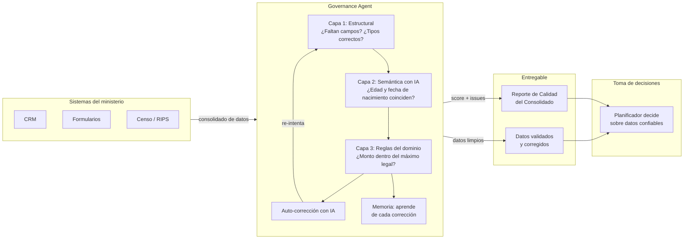
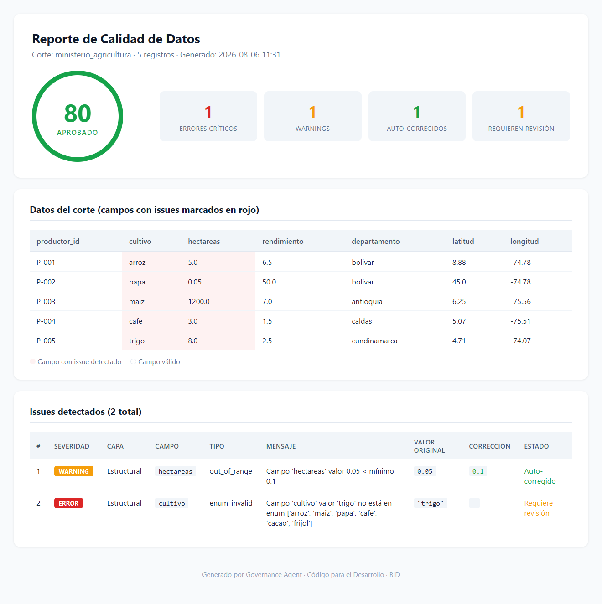

# Governance Agent

**Calidad de datos con IA para apoyar la gestión pública**

[](https://opensource.org/licenses/Apache-2.0)
[](https://www.python.org/downloads/)
[]()

---

## Tabla de contenidos

- [Descripción](#descripción)
- [El problema](#el-problema)
- [Cómo funciona](#cómo-funciona)
- [Arquitectura](#arquitectura)
- [Instalación](#instalación)
- [Uso rápido](#uso-rápido)
- [Domain Packs](#domain-packs)
- [Casos de uso](#casos-de-uso)
- [Roadmap](#roadmap)
- [Contribuir](#contribuir)
- [Licencia](#licencia)

---

## Descripción

Governance Agent es un framework de código abierto que asegura la calidad de los datos como insumo para la gestión pública. Cada ministerio o institución encapsula su nomenclador, reglas y validadores en un *Domain Pack* intercambiable. Cuando la institución consolida datos de sus sistemas para planificar o evaluar, Governance Agent valida que sean estructuralmente correctos, semánticamente consistentes mediante IA, y coherentes con el clasificador de variables del dominio.

Si hay errores, el agente los corrige automáticamente. Si no puede, pregunta al planificador sin detener el proceso. Y aprende de cada corrección para no repetir errores.

**¿Por qué?** Porque las decisiones de política pública —desde el diseño de un subsidio hasta el monitoreo de un programa— dependen de datos confiables. Si los datos tienen errores que nadie detectó, la decisión también estará equivocada.

**¿Para qué?** Entre otros usos: monitorear programas en ejecución, responder preguntas sobre los datos con confianza, detectar hallazgos que ningún sistema tradicional identifica, o gestionar de forma propositiva con datos integrados mediante el nomenclador.

**El resultado: gestión pública apoyada en datos confiables, sin importar la fuente.**

---

## El problema

La formulación de políticas públicas en América Latina y el Caribe se basa en datos extraídos de sistemas transaccionales que presentan problemas endémicos de calidad:

- **Inconsistencias lógicas no detectables por validación tradicional**: un formulario registra "edad: 25" y "fecha de nacimiento: 2010". Ambos campos son válidos individualmente, pero imposibles en conjunto. La validación estructural no lo detecta.
- **Nomencladores desactualizados o inconsistentes entre sistemas**: el Ministerio de Salud usa "cod_dx" para diagnóstico, el hospital usa "diagnostico", y el censo usa "CIE10". Ningún sistema los reconcilia.
- **Datos geográficamente inválidos**: coordenadas fuera del área de operación, depósitos a 500km de las rutas de entrega, puntos duplicados.
- **Errores de captura masivos**: el 30% de los registros de un consolidado pueden tener campos erróneos que pasan validación estructural pero son lógicamente imposibles.

Las herramientas existentes en el catálogo de Código para el Desarrollo abordan parte del problema: **Data Cleaner** aplica reglas sintácticas a CSV, **OpenRefine** permite limpieza manual, y **Atypical Data Classifier** detecta anomalías en encuestas. Sin embargo, ninguna combina validación semántica con IA, corrección automática, y generalidad para cualquier dominio de política pública.

---

## Cómo funciona



**El entregable**: un reporte de calidad del consolidado que muestra qué datos estaban mal, qué se corrigió automáticamente, y qué requiere revisión humana — antes de que el planificador use esos datos para tomar decisiones.



### Tres capas de validación

| Capa | Qué valida | Ejemplo |
|------|-----------|---------|
| **Estructural** | Tipos, campos obligatorios, valores permitidos | "El campo `fecha_nacimiento` está vacío" |
| **Semántica con IA** | Inconsistencias lógicas, valores implausibles | "Edad 25 con fecha de nacimiento 2010 es contradictorio" |
| **Reglas de dominio** | Coherencia con el nomenclador y restricciones del ministerio | "El monto del subsidio excede el máximo legal permitido" |

### Auto-corrección

Cuando se detectan errores críticos, el agente usa IA para corregir automáticamente los datos y re-intenta la validación (hasta 3 iteraciones). Si no puede corregir, bloquea y reporta.

### Human-in-the-loop

Los warnings (no críticos) se acumulan como preguntas batch para el planificador. No detienen el proceso. El planificador responde al final, y el agente aprende de sus respuestas.

### Memoria acumulativa

Cada corrección aceptada o rechazada se almacena en PackMemory. Tras 5 aceptaciones de la misma corrección, se auto-promueve a regla automática. El agente aprende del dominio.

---

## Arquitectura

```
governance-agent/
├── src/
│   ├── core/                          # Núcleo abstracto (domain-agnostic)
│   │   ├── domain_pack.py             # Schema de pack + loader + auto-generación
│   │   ├── validator.py               # Motor de validación multi-capa
│   │   ├── llm_adapter.py             # Adapter LLM (multi-provider con failover)
│   │   ├── orchestrator.py            # Orquestador: validar → corregir → solver
│   │   ├── pack_memory.py             # Memoria de correcciones con auto-promoción
│   │   ├── human_loop.py              # Human-in-the-loop batch
│   │   ├── profiler.py                # Profiler de datos
│   │   ├── inference.py               # Inferencia de mapeos de campos
│   │   ├── standards.py               # Registro dinámico de estándares
│   │   └── mcp_server_abstract.py     # MCP server abstracto
│   ├── domain_packs/                  # Packs de dominio (intercambiables)
│   │   ├── vrp/                       # Logística de entrega
│   │   │   ├── pack.yaml              # Schema + reglas + mapeos
│   │   │   └── vrp_validators.py      # Validadores custom
│   │   └── salud/                     # Nomenclador de salud
│   │       └── pack.yaml
│   ├── llm_client.py                  # Cliente LLM multi-provider con failover
│   └── mcp_server.py                  # MCP server (compatibilidad)
├── scripts/                           # Scripts de prueba y demostración
│   ├── quickstart.py                  # Demo out-of-the-box
│   ├── test_real_data.py              # Tests con datos reales
│   ├── test_llm_semantic.py           # Tests de capa semántica con LLM
│   ├── test_orchestrator.py           # Tests del orquestador completo
│   └── generate_vrp_pack.py           # Auto-generación de pack desde Pydantic
├── pyproject.toml
├── LICENSE
└── README.md
```

**Principio clave**: el núcleo (`core/`) no conoce ningún dominio. Todo el conocimiento de dominio vive en los packs (`domain_packs/`). Un nuevo ministerio = un nuevo pack. El código no se modifica.

---

## Instalación

### Requisitos

- Python 3.11+
- [uv](https://docs.astral.sh/uv/) (gestor de paquetes)
- API key de al menos un proveedor LLM:
  - Cualquier proveedor compatible con la API de OpenAI (varios ofrecen free tier)

### Pasos

```bash
# 1. Clonar el repositorio
git clone https://github.com/rogelioGuerrero/governance-agent.git
cd governance-agent

# 2. Instalar dependencias
uv sync

# 3. Configurar API keys
cp .env.example .env
# Editar .env con tu API key de cualquier proveedor compatible con OpenAI
#   Ej: GROQ_API_KEY=gsk_...  |  GEMINI_API_KEY=...  |  SAMBANOVA_API_KEY=...

# 4. Verificar instalación
uv run python scripts/quickstart.py
```

---

## Uso rápido

```python
from src.core.domain_pack import PackLoader
from src.core.validator import ValidationEngine
from src.core.llm_adapter import LLMAdapter
from src.core.pack_memory import PackMemory
from src.core.human_loop import HumanInTheLoop

# 1. Cargar el domain pack del ministerio
pack = PackLoader.from_yaml("src/domain_packs/salud/pack.yaml")

# 2. Configurar el motor de validación
llm = LLMAdapter(json_mode=True, temperature=0.1)
memory = PackMemory("salud")
hitl = HumanInTheLoop(pack_memory=memory)
engine = ValidationEngine(pack=pack, pack_memory=memory, hitl=hitl, llm_client=llm)

# 3. Validar el consolidado de datos
resultado = engine.validate(consolidado_de_datos)

# 4. Revisar resultados
print(f"Válido: {resultado.is_valid}")
print(f"Issues: {len(resultado.issues)}")
for issue in resultado.issues:
    print(f"  [{issue.severity}] {issue.field_name}: {issue.message}")
    if issue.suggested_value:
        print(f"    Sugerencia: {issue.suggested_value}")

# 5. Preguntas para el planificador (no bloqueantes)
for q in hitl.get_pending_questions():
    print(f"  [{q.level}] {q.field_name}: {q.message}")
```

---

## Domain Packs

Un Domain Pack encapsula todo el conocimiento de un dominio de política pública:

| Componente | Descripción | Ejemplo |
|-----------|-------------|---------|
| **Schema fields** | Campos esperados, tipos, obligatoriedad | `locations.id` (string, requerido), `locations.coords` (array[float], requerido) |
| **Semantic rules** | Reglas lógicas en lenguaje natural para la IA | "end_time del vehículo ≥ time_window_end más tardío" |
| **Inference mappings** | Sinónimos de campos para interoperabilidad | `lat` ↔ `latitude` ↔ `latitud` ↔ `y` |
| **Custom validators** | Validadores específicos en Python | Coordenadas en área de operación, balance pickup-delivery |
| **Standards** | Nomencladores y clasificadores del dominio | CIE-10, CUOC, cultivos permitidos |
| **Metadata** | Configuración del dominio | Área geográfica, horas típicas de servicio |

### Packs disponibles

| Pack | Dominio | Estado |
|------|---------|--------|
| `vrp` | Logística de optimización de rutas | Funcional con datos reales |
| `salud` | Nomenclador de salud | Funcional |

### Crear un nuevo pack

```bash
# Auto-generar desde un modelo Pydantic existente
uv run python scripts/generate_vrp_pack.py

# O crear manualmente un pack.yaml
# Ver src/domain_packs/salud/pack.yaml como ejemplo
```

---

## Casos de uso

### Ministerio de Agricultura

Un ministerio de agricultura necesita apoyar una política de subsidios a pequeños productores. Consolida los datos anuales de su registro de productores. Governance Agent valida:

- **Estructural**: todos los registros tienen ID, cultivo, hectáreas, rendimiento
- **Dominio**: el cultivo existe en el nomenclador, las coordenadas están en área agrícola
- **Semántica (IA)**: "rendimiento de 50 ton/ha en papa es implausible (rango normal: 15-25). ¿Corregir a 18?"

### Ministerio de Salud

Un ministerio de salud consolida datos de RIPS, SISS y el censo para evaluar cobertura. Governance Agent valida:

- **Estructural**: todos los registros tienen código de diagnóstico, edad, municipio
- **Dominio**: el código CIE-10 existe en el nomenclador, el municipio es válido
- **Semántica (IA)**: "edad 25 con fecha de nacimiento 2010 es contradictorio. ¿Corregir fecha a 1999?"

### Programa de Beneficencia Social

Un programa de transferencias condicionadas verifica la elegibilidad de beneficiarios antes de emitir pagos. Governance Agent valida:

- **Estructural**: todos los registros tienen ID, ingresos, composición familiar, actividad económica
- **Dominio**: no hay duplicados entre programas, los ingresos están dentro del umbral
- **Semántica (IA)**: "ingresos de $5,000 con actividad 'desempleado' es inconsistente. ¿Revisar actividad económica?"

### Alcaldía Municipal

Una alcaldía consolida datos de catastro, registro civil y servicios públicos para planificar inversiones locales. Governance Agent valida:

- **Estructural**: todos los registros tienen dirección, predio, contribuyente
- **Dominio**: el predio existe en el catastro, la dirección corresponde al municipio
- **Semántica (IA)**: "un predio de 5 m² declarado como residencia familiar es implausible. ¿Revisar superficie?"

### Consulta de viabilidad de política pública

Una vez que el nomenclador está construido, la institución puede consultar el grafo para responder preguntas de política pública antes de invertir en nuevos sistemas:

- **¿Podemos monitorear esta política?** — El gobierno consulta qué variables necesita el indicador, en qué sistemas están, y con qué calidad. Si la variable existe en dos sistemas pero con 60% de completitud, sabe que necesita mejorar la captura antes de usar el dato.
- **¿Podemos actualizar el indicador sin crear un sistema nuevo?** — El gobierno consulta los caminos de interoperabilidad entre sistemas. Si el censo y el hospital comparten la variable "sexo" con el mismo clasificador ISO 5218, puede cruzarlos sin construir un nuevo pipeline.
- **¿Podemos crear una política nueva con variables que ya existen?** — El gobierno descubre que tiene variables dispersas en tres ministerios que, combinadas, permiten diseñar un programa de transferencias condicionadas. El nomenclador identifica qué variables están disponibles, en qué fuentes, y qué calidad tienen — sin necesidad de nuevas encuestas.

---

## Roadmap

- [x] Núcleo abstracto con validación multi-capa
- [x] Integración LLM agnóstica (cualquier proveedor compatible con OpenAI)
- [x] Auto-corrección de errores con IA
- [x] PackMemory con auto-promoción de reglas
- [x] Human-in-the-loop batch no intrusivo
- [x] Orquestador completo: validar → corregir → solver
- [x] Auto-generación de packs desde modelos Pydantic
- [x] MCP server abstracto para integración con asistentes IA
- [ ] Conectores para sistemas gubernamentales (API, DB, CSV, SFTP)
- [ ] Nomenclador canónico como puente entre sistemas
- [ ] UI web para planificadores no técnicos
- [ ] Dashboard de calidad de datos por dominio

*Estas funcionalidades están en desarrollo y se incorporarán en futuras versiones.*

---

## Contribuir

Las contribuciones son bienvenidas. Ver [CONTRIBUTING.md](CONTRIBUTING.md) para guidelines.

Áreas donde se busca ayuda:

- **Domain packs nuevos**: agricultura, educación, vivienda, beneficencia social
- **Conectores**: adaptadores para sistemas gubernamentales específicos
- **Validadores semánticos**: reglas de dominio para nuevos ministerios
- **Documentación**: traducciones, guías de implementación, casos de estudio

---

## Autores

**AGTI SA de CV** — El Salvador

Governance Agent es desarrollado y mantenido por AGTI SA de CV como contribución al ecosistema de código abierto para la gestión pública en América Latina y el Caribe.

- **Repositorio**: [https://github.com/rogelioGuerrero/governance-agent](https://github.com/rogelioGuerrero/governance-agent)
- **Contacto**: [info@agtisa.com](mailto:info@agtisa.com)

---

## Licencia

[Apache License 2.0](LICENSE) — permite uso comercial, modificación y distribución con atribución.

---

## Contacto

Para colaboración, adaptación o reportar problemas:

- **GitHub Issues**: [https://github.com/rogelioGuerrero/governance-agent/issues](https://github.com/rogelioGuerrero/governance-agent/issues)
- **Email**: [info@agtisa.com]

---

*Governance Agent es un Bien Público Digital candidato al catálogo de Código para el Desarrollo del BID.*
